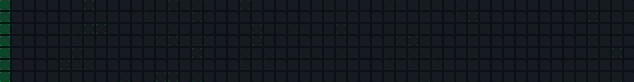

# Contribution LED Marquee ⚡

A GitHub Action that generates an animated LED marquee visualization using your GitHub Contribution Graph.



## Features

- 📊 **Wave Effect**: Contribution graph appears with a left-to-right wave animation
- 🎬 **LED Marquee**: Scrolling text in authentic LED style with shadow effects
- ✨ **Seamless Loop**: Infinite animation cycling between graph and text
- 🎨 **Custom Bitmap Font**: 5×7 pixel font (a-z, A-Z, 0-9, symbols) with shadow
- 🔧 **Fully Customizable**: Adjust cell size, speed, delay, and more
- 🌈 **GitHub Color Palette**: Uses official contribution graph colors

## How it works

1. **Wave Animation**: Contribution graph lights up column-by-column from left to right
2. **Display**: Graph stays visible for a configurable time (default: 3 seconds)
3. **Transition**: Instantly switches to LED marquee mode
4. **Marquee**: Text scrolls right-to-left with discrete column animation
5. **Loop**: Returns to step 1 for seamless infinite animation

## Usage

### Option 1: Use in This Repository (Recommended)

This repository includes a workflow that generates the marquee automatically.

1. **Edit the workflow** (`.github/workflows/marquee.yml`) to customize your text
2. **Enable GitHub Actions** in repository settings
3. **Trigger manually** or wait for scheduled run

The workflow will:
- Fetch your contribution data
- Generate the marquee SVG
- Commit the result to your repository

### Option 2: Use as a Reusable Action

To use this action in another repository, create `.github/workflows/marquee.yml`:

```yaml
name: Generate Contribution LED Marquee

on:
  schedule:
    - cron: '0 0 * * *' # Daily at midnight
  workflow_dispatch: # Manual trigger

jobs:
  generate:
    runs-on: ubuntu-latest
    steps:
      - uses: actions/checkout@v4

      - name: Generate Marquee
        uses: your-username/contribution-led-marquee@v1
        with:
          github_user_name: ${{ github.repository_owner }}
          text: 'HELLO WORLD ☆'
          show_contributions: true
          cell_size: '10'
          cell_gap: '2'
          scroll_speed: '4'
          initial_delay: '3'
          output_path: 'dist/marquee.svg'

      - name: Commit and push
        run: |
          git config --local user.email "action@github.com"
          git config --local user.name "GitHub Action"
          git add dist/marquee.svg
          git commit -m "Update marquee" || exit 0
          git push
```

### Local Development

```bash
# Install dependencies
npm install

# Build TypeScript
npm run build

# Run test (generates SVG locally)
npm run test

# Check output
open dist/marquee.svg
```

## Inputs

| Input | Required | Default | Description |
|-------|----------|---------|-------------|
| `github_user_name` | Yes | - | GitHub username to fetch contributions for |
| `text` | Yes | - | Text to display in the LED marquee (supports a-z, A-Z, 0-9, symbols) |
| `show_contributions` | No | `true` | Show contribution graph before text |
| `cell_size` | No | `10` | Size of each cell in pixels |
| `cell_gap` | No | `2` | Gap between cells in pixels |
| `scroll_speed` | No | `4` | Scroll speed in columns per second |
| `initial_delay` | No | `3` | Seconds before graph disappears |
| `output_path` | No | `dist/marquee.svg` | Path where the SVG file will be saved |

## Outputs

| Output | Description |
|--------|-------------|
| `svg_path` | Path to the generated SVG file |

## Example

Embed in your README:

```markdown

```

## Customization

All parameters can be configured via GitHub Actions inputs (see [Inputs](#inputs) section). No code changes needed!

### Supported Characters

The custom bitmap font includes:
- **Uppercase**: A-Z
- **Lowercase**: a-z
- **Numbers**: 0-9
- **Symbols**: `! ? . , : ; - + = * / ( ) @ # $ % &`
- **Space**: ` `

### Shadow Effect

Each character has a shadow effect:
- Shadow appears to the right of lit pixels
- Creates a 3D depth effect
- Shadow color: `#0e4429` (GitHub contribution level 1)
- Main LED color: `#26a641` (GitHub contribution level 3)

## Font

Custom 5×7 pixel bitmap font with shadow (total 6×7 with shadow column). Designed specifically for LED marquee displays with authentic retro aesthetics.

## Architecture

```
src/
├── fetch.ts       # Fetches GitHub contribution data
├── parser.ts      # Parses contribution HTML to grid
├── bitmapFont.ts  # Custom 5×7 bitmap font with shadow
├── renderText.ts  # Renders text using bitmap font
├── led.ts         # Converts pixel data to LED number array (0, 0.5, 1)
├── svg.ts         # Generates animated SVG with SMIL animations
└── index.ts       # Main entry point (GitHub Action)
```

## How It Works

### 1. Fetch Contribution Data
Retrieves your GitHub contribution graph from `https://github.com/users/{username}/contributions`

### 2. Text Rendering
- Uses custom bitmap font defined in `bitmapFont.ts`
- Each character is 5×7 pixels (6×7 with shadow)
- Shadow automatically added to right side of lit pixels
- 1px spacing between characters

### 3. LED Conversion
Converts pixel data to number array with three values:
- `0`: Off (background)
- `0.5`: Shadow (darker green `#0e4429`)
- `1`: Main LED (brighter green `#26a641`)

### 4. SVG Generation
Creates animated SVG with SMIL animations:
- **Base Grid Layer**: Dark background cells always visible during contribution phase
- **Contribution Layer**: Colored cells with left-to-right wave effect
- **Grid Layer**: Dark cells for LED mode background
- **LED Layer**: Scrolling text with discrete column-by-column animation
- All animations use `calcMode="discrete"` for authentic LED look

## License

MIT

## Credits

Built with:
- Custom bitmap font (5×7 with shadow)
- SVG SMIL animations
- GitHub Contribution Graph API
- TypeScript + GitHub Actions
