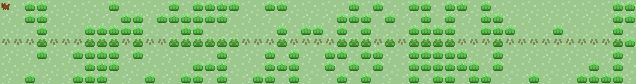

# Dog RPG GitHub Action

Generate a pixel RPG visualization of your GitHub contributions with a dog character walking across the map!

## Features

- Converts GitHub contribution graph into an RPG-style tile map
- Animated dog character that walks toward treasure tiles
- Different tile types based on contribution count:
  - 0 contributions → Grass
  - 1 contribution → Flower
  - 2 contributions → Rock
  - 3 contributions → Tree
  - 4+ contributions → Treasure
- A* pathfinding for intelligent dog movement
- Paw prints showing the dog's trail
- Pure SVG output (no external images)

## Usage

### In a GitHub Workflow

Create `.github/workflows/dog-rpg.yml`:

```yaml
name: Generate Dog RPG Visualization

on:
  schedule:
    # Run daily at 00:00 UTC
    - cron: '0 0 * * *'
  workflow_dispatch:
  push:
    branches: [main]

jobs:
  generate:
    runs-on: ubuntu-latest
    steps:
      - uses: actions/checkout@v4

      - name: Generate Dog RPG SVG
        uses: yourusername/dog-rpg-action@v1
        with:
          github_user_name: ${{ github.repository_owner }}
          output_path: 'dog-rpg.svg'

      - name: Commit SVG
        run: |
          git config user.name "GitHub Actions"
          git config user.email "actions@github.com"
          git add dog-rpg.svg
          git commit -m "Update Dog RPG visualization" || echo "No changes"
          git push
```

### In Your Profile README

Add to your profile README.md:

```markdown
## My GitHub Journey 🐕


```

## Development

### Setup

```bash
npm install
```

### Build

```bash
npm run build
npm run package
```

### Test Locally

```bash
# Set required environment variables
export INPUT_GITHUB_USER_NAME="your-username"

# Run the action
npm run dev
```

## Project Structure

```
dog-rpg-action/
├── src/
│   ├── fetch.ts       # Fetches GitHub contribution data
│   ├── parser.ts      # Parses HTML to extract contribution grid
│   ├── map.ts         # Converts contributions to tile types
│   ├── pathfinding.ts # A* algorithm for dog movement
│   ├── render.ts      # SVG generation with sprites
│   └── index.ts       # Main entry point
├── dist/              # Compiled JavaScript
├── action.yml         # GitHub Action metadata
├── package.json       # Node dependencies
└── tsconfig.json      # TypeScript config
```

## Customization

### Tile Mapping

Edit `src/map.ts` to change how contributions map to tiles:

```typescript
function getTileType(contributions: number): TileType {
  if (contributions === 0) return TileType.GRASS;
  if (contributions === 1) return TileType.FLOWER;
  if (contributions === 2) return TileType.ROCK;
  if (contributions === 3) return TileType.TREE;
  return TileType.TREASURE;
}
```

### Dog Sprite

Modify the dog sprite in `src/render.ts` by editing the SVG rectangles in the `getSpriteDefs()` function.

### Animation Speed

Change `ANIMATION_DURATION` in `src/render.ts` to adjust the dog's walking speed.

## Roadmap

- [ ] Multiple dogs for collaborative projects
- [ ] Different themes (desert, snow, space)
- [ ] Random wandering mode
- [ ] Collectible items along the path
- [ ] Day/night cycle based on contribution times

## License

MIT